# 🐶🐱 Dog vs Cat Image Classification using HOG + SVM

This repository implements a **binary image classification** system to distinguish between images of **dogs** and **cats** using classical machine learning. Instead of deep learning or CNNs, this project utilizes **HOG (Histogram of Oriented Gradients)** features and a **Support Vector Machine (SVM)** with an RBF kernel.

📌 **Task Objective:**  
Predict whether a given image contains a **dog** or a **cat**, based on handcrafted features.

---

## 🔧 Features

- 🔹 Data loading and preprocessing from Kaggle dataset
- 🔹 Feature extraction using multi-channel HOG descriptors
- 🔹 Train-test split with stratified sampling
- 🔹 SVM training with RBF kernel
- 🔹 Evaluation using accuracy, log loss, confusion matrix
- 🔹 Visual analysis of confidence scores
- 🔹 Random prediction visualization with confidence score
- 🔹 Generates `submission.csv` for Kaggle competition format

---

## 📂 Dataset

- **Source:** [Dogs vs Cats – Kaggle Competition](https://www.kaggle.com/c/dogs-vs-cats/data)
- **Training Folder:** `/train` — 25,000 images labeled via filenames (`dog.*`, `cat.*`)
- **Test Folder:** `/test1` — 12,500 unlabeled images
- **Subset Used:** 5,000 training images (for faster execution)

---

## 🛠️ Workflow

1. **Data Preprocessing** 🧹  
   - Read `.jpg` files from train/test directories  
   - Resized to `128×128`  
   - HOG features extracted per color channel (R, G, B)  
   - Final feature vector = concatenation of 3 channel-wise HOGs

2. **Train-Validation Split** 🔀  
   - 80:20 split using `train_test_split`  
   - Stratified to maintain class balance

3. **Model Training** 🤖  
   - SVM with RBF kernel  
   - Trained on extracted HOG features

4. **Evaluation** 📊  
   - Accuracy: `77.5%`  
   - Log Loss: `0.4955`  
   - Classification Report & Confusion Matrix  
   - Confidence distribution plots  
   - Visualization of random predictions with probability

5. **Kaggle Submission** 📤  
   - Prediction on `/test1` set  
   - Output saved as `submission.csv` with image IDs and dog probabilities

---

## 🧠 Methodology

- **Feature Extraction** 🧮  
  Used `skimage.feature.hog()` on each RGB channel independently, then combined into a single feature vector.

- **Model Choice**  
  Selected `SVC(kernel="rbf", probability=True)` due to its effectiveness on non-linear data.

- **Visualization Tools**  
  - Seaborn Heatmaps  
  - Histograms of predicted probabilities  
  - Matplotlib image previews with prediction labels and confidence

---

## ✅ Results

📋 **Classification Report (Validation Set - 1000 Samples):**

| Metric        | Cat   | Dog   |
|---------------|-------|-------|
| Precision     | 0.77  | 0.78  |
| Recall        | 0.78  | 0.77  |
| F1-Score      | 0.78  | 0.77  |
| Support       | 500   | 500   |

| Overall Metric       | Score     |
|----------------------|-----------|
| ✅ Accuracy           | **77.50%** |
| 📉 Log Loss           | **0.4955** |
| 🎯 Average Confidence | **90.46%** |

🧠 The SVM classifier with an RBF kernel demonstrated strong and balanced performance across both classes. The high average confidence score of **90.46%** indicates the model is not only accurate but also confident in its predictions. The log loss remains acceptably low, reflecting good probability calibration.


📁 **Submission File:** `submission.csv`

---

## 📸 Visual Outputs

<div align="center">

<table>
  <tr>
    <td>
      <strong>📊 Confusion Matrix</strong><br>
      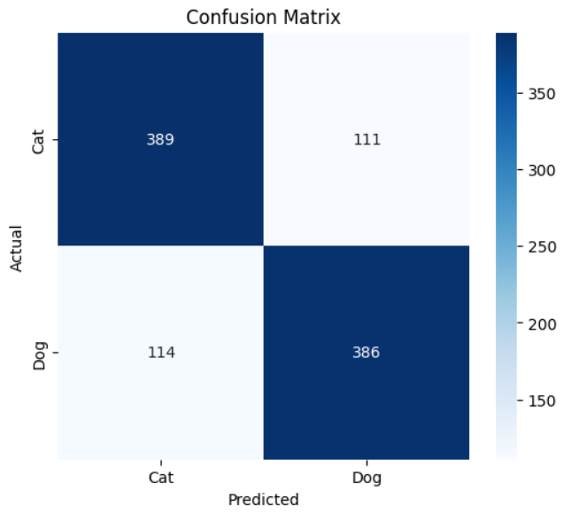
    </td>
    <td>
      <strong>📈 Class Confidence Distribution</strong><br>
      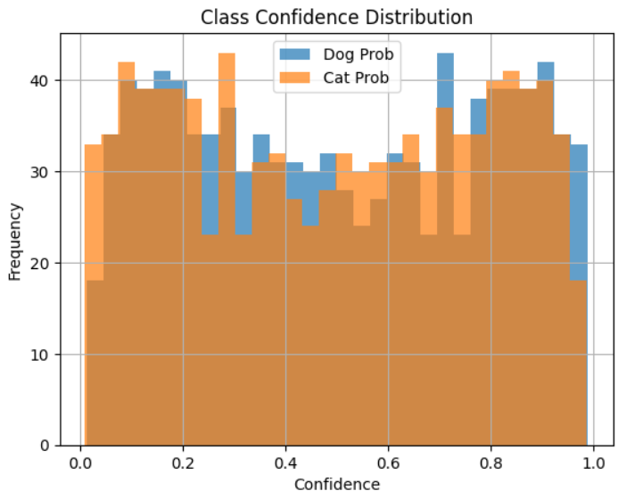
    </td>
  </tr>
  <tr>
    <td>
      <strong>📉 Calibration Curve</strong><br>
      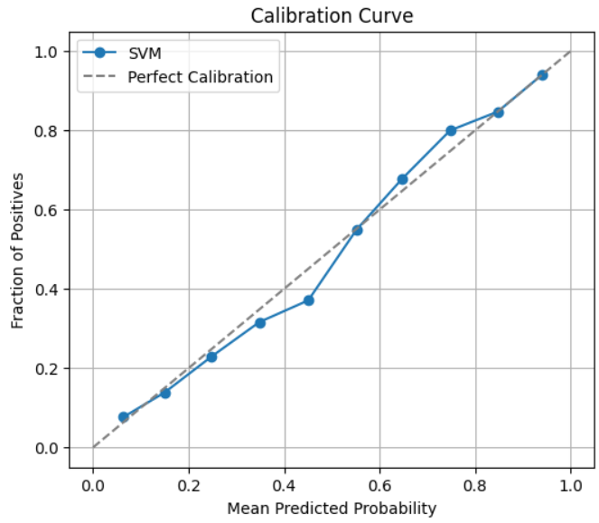
    </td>
    <td>
      <strong>📍 ROC Curve</strong><br>
      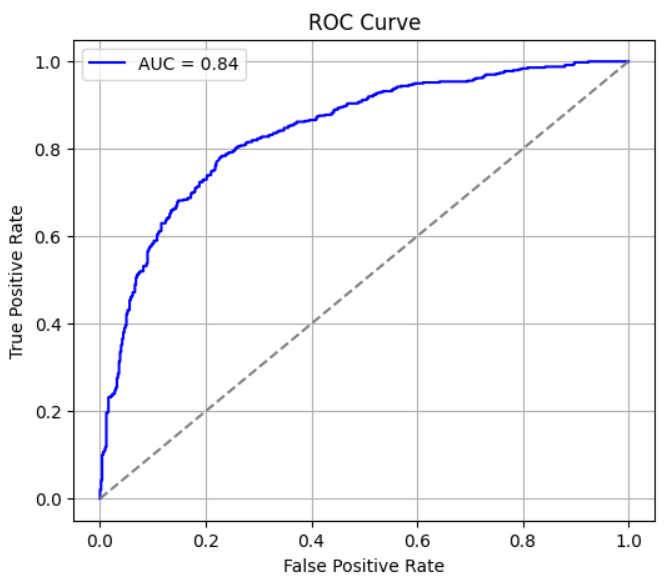
    </td>
  </tr>
  <tr>
    <td>
      <strong>🔍 t-SNE Embedding</strong><br>
      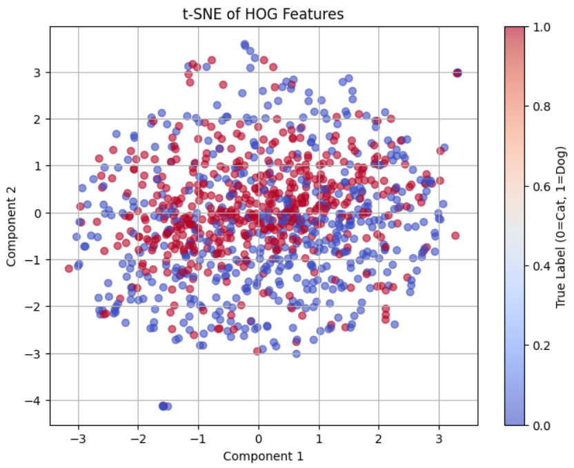
    </td>
    <td>
      <strong>🌐 UMAP Projection</strong><br>
      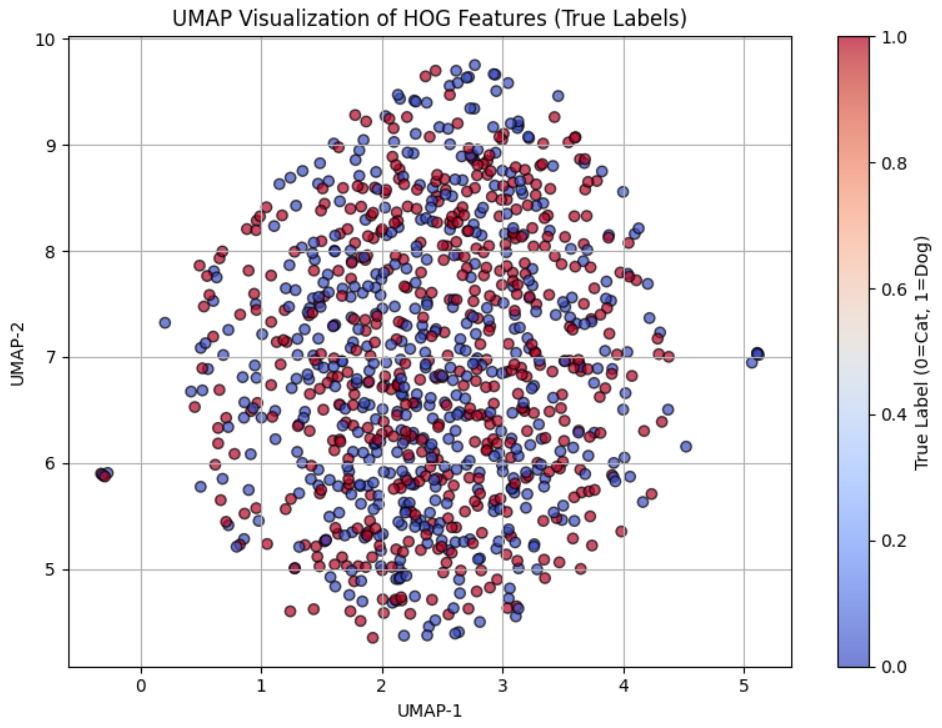
    </td>
  </tr>
  <tr>
    <td>
      <strong>🎯 Per-Class Accuracy</strong><br>
      
    </td>
    <td>
      <strong>📶 Cumulative Accuracy Curve</strong><br>
      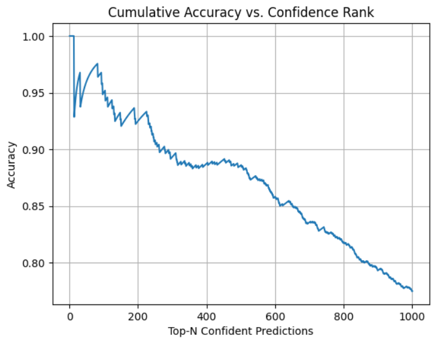
    </td>
  </tr>
  <tr>
    <td>
      <strong>📤 Prediction Probability by True Class</strong><br>
      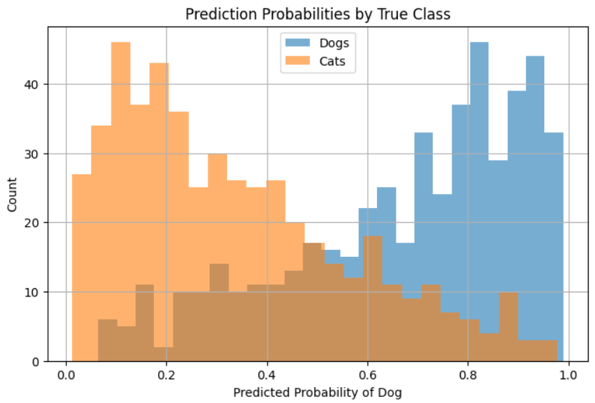
    </td>
    <td>
      <strong>🔁 Recall Curve</strong><br>
      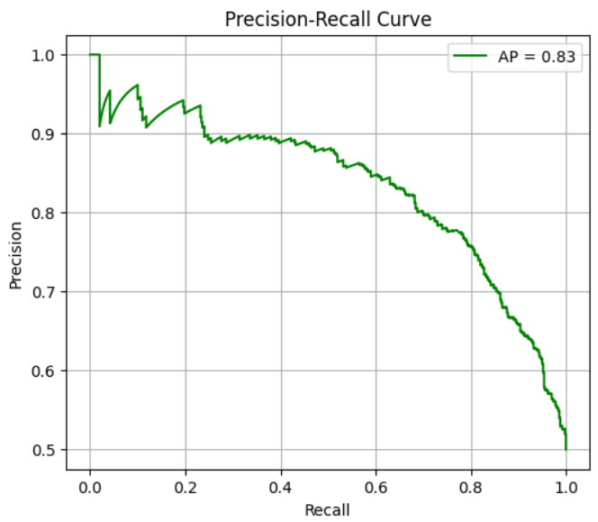
    </td>
  </tr>
  <tr>
    <td colspan="2">
      <strong>🖼️ Random Prediction with Confidence</strong><br>
      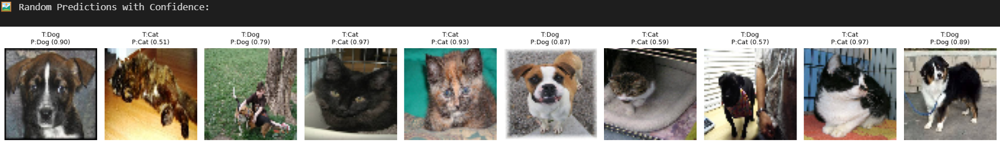
    </td>
  </tr>
  <tr>
    <td colspan="2">
      <strong>📌 Single Prediction Sample</strong><br>
      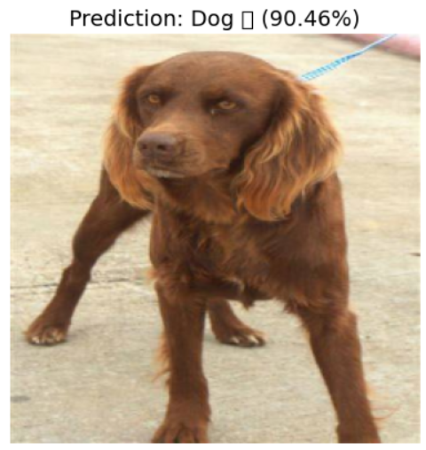
    </td>
  </tr>
</table>

</div>


---

## 🚀 Getting Started

1. Clone the repository  
   `git clone https://github.com/shreyakmukherjee/svm-dog-vs-cat-classifier.git`  
   `cd svm-dog-vs-cat-classifier`

2. Install dependencies  
   `pip install -r requirements.txt`

3. Run the notebook  
   Open `dogs-vs-cat-image-classification.ipynb` in Jupyter or Colab.

4. Custom prediction  
   Use the following function inside the notebook to test a random validation image:  
   ```python
   predict_custom_val()

## 📌 Dependencies  
- opencv-python  
- numpy  
- matplotlib  
- pandas  
- scikit-learn  
- scikit-image  
- seaborn  
- tqdm  

---

## 🧠 Algorithm Used  
SVC from `sklearn.svm` using **RBF kernel**  
HOG from `skimage.feature`

---

## 📌 License  
This project is licensed under the **MIT License** – see the LICENSE file for details.

---

## ✍️ Author  
👤 **Shreyak Mukherjee**  
📂 GitHub: [shreyakmukherjee](https://github.com/shreyakmukherjee)  
🔗 LinkedIn: [https://www.linkedin.com/in/shreyak-mukherjee-203558275/](https://www.linkedin.com/in/shreyak-mukherjee-203558275/)  
Feel free to connect or explore more projects!
